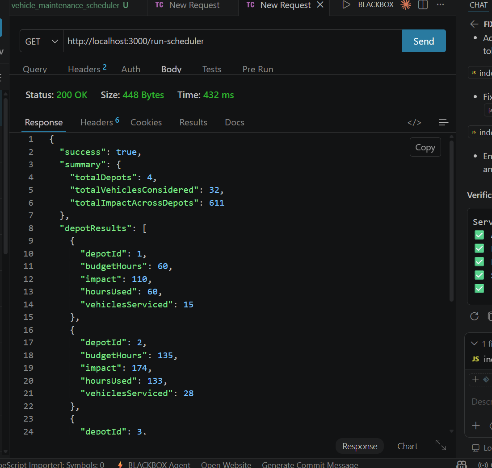
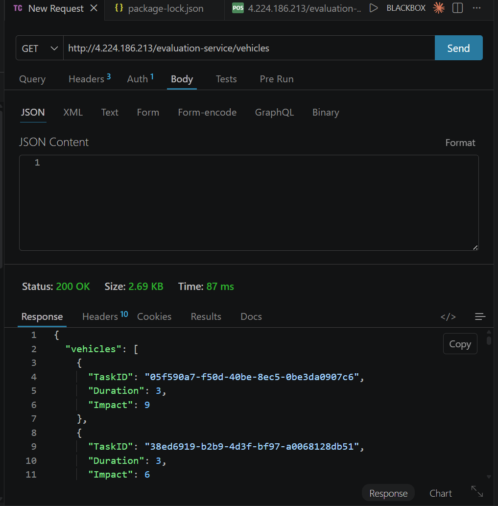
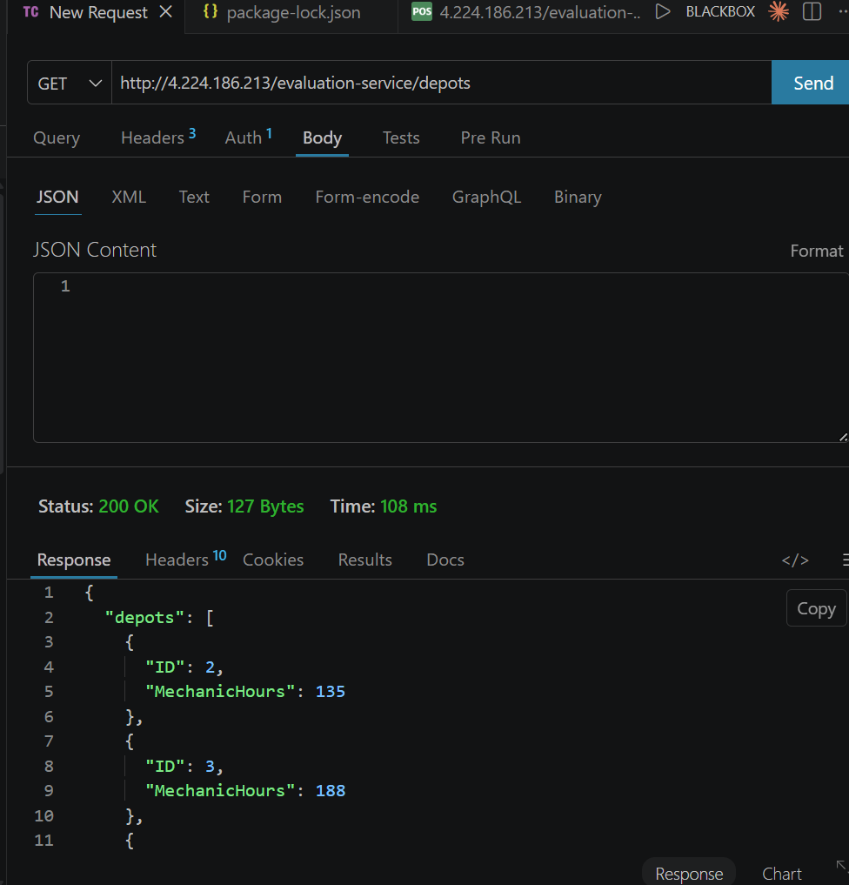

# Vehicle Maintenance Scheduler & Notification Backend

## Project Steps Taken

1. Built logging middleware as first function that calls test server log API
2. Implemented registration and authentication with test server
3. Created vehicle maintenance scheduler using 0/1 knapsack dynamic programming
4. Fetched depots and vehicles from protected APIs
5. Solved optimal vehicle selection for each depot within mechanic hour budget
6. Designed notification system with REST APIs, database schema, and optimization strategies
7. Implemented priority inbox to sort notifications by type weight (Placement > Result > Event) and recency
8. Added min heap based approach for real time top K maintenance

## Setup and Run

```bash
cd notification_app_be
npm install
npm start
```

Server runs on http://localhost:3000

## API Endpoints

| Method | Endpoint | Description |
|--------|----------|-------------|
| GET | /health | Health check |
| GET | /run-scheduler | Run vehicle maintenance scheduler |
| GET | /api/inbox?n=10 | Get top N priority notifications |
| GET | /api/inbox/stream?n=10 | Get top N using min heap |

## Task 3 Screenshots

Vehicle scheduler that solves knapsack for each depot.



<br/><br/>




<br/><br/>




## Task 5 Screenshots

Priority inbox showing Placement notifications first.


<br/><br/>


<br/><br/>


## Sample Output

```
Server started on http://localhost:3000
Scheduler done
Depots: 3
Vehicles: 39
Total impact: 624
```

## Tech Stack

- Node.js with Express
- Axios for API calls
- Custom logging middleware
- Dynamic programming for knapsack
- Min heap for priority inbox
```
